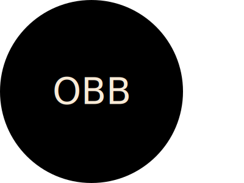

# js-svc-generator

An SVG generator

## Description

A logo generator built on node.js. This program will
generate a new logo.svg file in an output directory with values
that a user enters at run-time.

## Table of Contents

- [General Functionality](#general-functionality)
- [Screenshots](#screen-shots)
- [Installation](#installation)
- [Usage](#usage)
- [Credits](#credits)
- [License](#licensing)
- [Contributing](#contributing)
- [Testing](#testing)

### General Functionality

The program will ask a user questions that are needed to fulfill
the requirements of generating a unique and complete logo.svg file.

- Default Size:

  The default size for the SVG generated is width: 200 x height: 300. Optionally,
  a non-default size may be entered if desired, and the prompts will ask for a
  height and width.

- Logo Text:

  Text for the logo is required and validated to be no more than three characters.

- Color Selections:

  The logo.svg will have a color for the shape, logo text, and optional shape border and
  text border. Color selection is either via a selection from a list of colors or manual input of a hexidecimal color code, depending on preference.

- Border Selections:

  The logo.svg may have optional borders for the shape and/or the logo text if desired.
  If a border is used then a prompt will ask for border width and border color for the
  respective objects.

- Font Size:

  The default font size is 60, but may be optionally set to a different value as desired.

### Screen Shots

#### Initial Launch from Command Line

#### Custom SVG Size

#### Color Selection via List

#### Color Selection via Manual HEX entry

#### Font Sizing

#### Text Border

#### Shape Selection

#### Shape Border

#### Completion

#### A Generated logo.svg

### Installation

1.  Install Node.js version 20.x or newer
2.  Clone https://github.com/ericroys-school/js-svc-generator.git
3.  `cd` into the `js-svc-generator` directory
4.  Run `npm i` to load all the project dependencies
5.  Run the program via `node index.js`

### Usage

As mentioned in the installation instructions, you run the program with `node index.js`. This will launch an interactive question and answer session. Once the Q&A is complete a logo.svg file is created in the output directory.

You can watch a quick [video](https://drive.google.com/file/d/1ggqljF_TFaj4YDSj5mfdK-0O5z_vpkAm/view) on how the process works if you are not satisfied with the screenshots provided.

There is a sample logo.svg located in [examples](./examples/logo.svg)

### Credits

No kittens, puppies, armadillos, otter, or octopi were harmed in the making of this project.

### Licensing

As per always, this repo is licensed with [The Unlicense](http://choosealicense.com/licenses/unlicense) so feel free to do whatever. Share with your kids, dogs, neighbors, mail carrier, etc. Have a nice day!

### Contributing

Feel free to reach out via email @ eric.roys@gmail.com if you are interested in contributions to the project or have any kindly suggestions for improvements and/or enhancements. Tanks, Sherman!

### Testing

The repo comes with jest unit test which can be run with `npm test`
